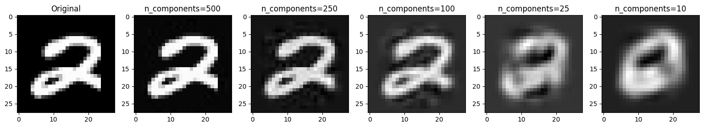

# Principal Component Analysis
Principal component analysis is a method of dimensionality reduction that takes all of some data's input features and finds the n dimensions in which the data vary the most.  A PCA model is said to be "fit" when these dimensions of greatest variance are found on some training subset of the data.  This model can then make transformations on other, new data of the same shape by projecting that data onto the previously discovered n dimensions; in other words, the model extracts the n principal components from the new data.

This is a very popular method of dimensionality reduction.  Its effect is often demonstrated by fitting a PCA model on a set of images, then projecting those images onto the n principal components that the model found when it was fit.  The projected images are then displayed to show how PCA maintains information from the original data while using fewer variables.  This is one such demonstration.

# MNIST Handwritten Digit Database
This is an extremely popular database in the realm of machine learning and computer vision and [can be found here](http://yann.lecun.com/exdb/mnist/).  Each of the images in the dataset used are 28x28 images, i.e. they each have 784 input features, each of these features being the strength of an individual pixel.

# This Repository
The code in this repo uses bare Python and NumPy to find the n principal components of a small subset of the MNIST digit data.  Matplotlib is then used to display the images' projections onto the n principal components.  In short, the code in this repo performs PCA on some MNIST image data and shows off the images' PCA projections.  Instead of loading in the data by hand each time, a pre-saved mnist.npy file is used to load the data into NumPy.  Examples of the PCA projection are shown below.

## Examples

